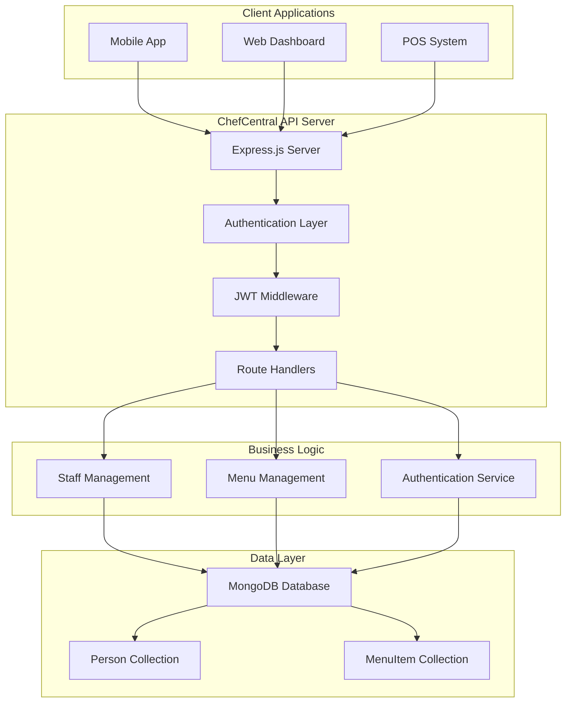
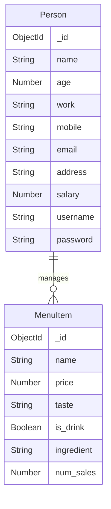

# 🍽️ ChefCentral Restaurant Management System

**ChefCentral** is a comprehensive backend API system designed to help restaurants manage their daily operations efficiently. This system handles staff management, menu operations, and secure authentication for restaurant personnel.

## 📋 Table of Contents

- [Features](#-features)
- [Technology Stack](#-technology-stack)
- [System Architecture](#-system-architecture)
- [Database Schema](#-database-schema)
- [Installation Guide](#-installation-guide)
- [Environment Setup](#-environment-setup)
- [API Endpoints](#-api-endpoints)
- [Usage Examples](#-usage-examples)
- [Project Structure](#-project-structure)
- [Security Features](#-security-features)
- [Contributing](#-contributing)

## ✨ Features

### 👥 Staff Management
- **Register new staff members** (chefs, waiters, managers)
- **Secure login system** with username and password
- **View staff profiles** and information
- **Update staff details** (salary, contact info, etc.)
- **Delete staff records** when needed
- **Filter staff by role** (chef, waiter, manager)

### 🍕 Menu Management
- **Add new menu items** with details like price, taste, ingredients
- **View all menu items** in the restaurant
- **Update menu item details** (price changes, new ingredients)
- **Delete menu items** that are no longer available
- **Track sales numbers** for each menu item
- **Manage drink vs food items** classification

### 🔐 Security & Authentication
- **JWT-based authentication** for secure API access
- **Password encryption** using bcrypt hashing
- **Role-based access control** for different staff levels
- **Token-based session management**
- **Secure user registration and login**

## 🛠️ Technology Stack

| Component | Technology |
|-----------|------------|
| **Backend Framework** | Node.js + Express.js |
| **Database** | MongoDB |
| **ODM** | Mongoose |
| **Authentication** | JWT (JSON Web Tokens) |
| **Password Security** | bcrypt |
| **Environment Management** | dotenv |
| **API Testing** | Built-in Express routes |

## 🏗️ System Architecture



## 📊 Database Schema



### Person Schema
- **name**: Staff member's full name (required)
- **age**: Age of the staff member
- **work**: Role in restaurant - chef, waiter, or manager (required)
- **mobile**: Contact phone number (required)
- **email**: Email address (required, unique)
- **address**: Home address
- **salary**: Monthly salary amount (required)
- **username**: Login username (required, unique)
- **password**: Encrypted password (required)

### MenuItem Schema
- **name**: Name of the dish/drink (required)
- **price**: Price in restaurant currency (required)
- **taste**: Flavor profile description
- **is_drink**: Boolean flag for beverages (default: false)
- **ingredient**: List of main ingredients
- **num_sales**: Number of times item was sold (default: 0)

## 🚀 Installation Guide

### Prerequisites
Make sure you have the following installed:
- **Node.js** (version 14 or higher)
- **MongoDB** (local installation or MongoDB Atlas account)
- **npm** (comes with Node.js)

### Step 1: Clone the Repository
```bash
git clone <your-repository-url>
cd ChefCentral-Restaurant-managemnt-System
```

### Step 2: Install Dependencies
```bash
npm install
```

### Step 3: Set Up Environment Variables
Create a `.env` file in the project root:
```env
PORT=3000
MONGODB_URL=mongodb://localhost:27017/chefcentral
JWT_SECRET=your_super_secret_jwt_key_here
```

### Step 4: Update Database Connection
Edit the `db.js` file and replace the MongoDB connection string:
```javascript
mongoose.connect(process.env.MONGODB_URL, {
  useNewUrlParser: true,
  useUnifiedTopology: true
});
```

### Step 5: Start the Server
```bash
npm start
# or for development with auto-restart
npx nodemon server.js
```

The server will start on `http://localhost:3000`

## 🌍 Environment Setup

Create a `.env` file with these variables:

```env
# Server Configuration
PORT=3000

# Database Configuration
MONGODB_URL=mongodb://localhost:27017/chefcentral

# Security Configuration
JWT_SECRET=your_very_secure_random_string_here

# Optional: For production
NODE_ENV=production
```

## 🔌 API Endpoints

### 🔐 Authentication Endpoints

| Method | Endpoint | Description | Authentication |
|--------|----------|-------------|----------------|
| `POST` | `/person` | Register new staff member | None |
| `POST` | `/person/login` | Login existing staff member | None |
| `GET` | `/person/profile` | Get current user profile | JWT Required |

### 👥 Staff Management Endpoints

| Method | Endpoint | Description | Authentication |
|--------|----------|-------------|----------------|
| `GET` | `/person` | Get all staff members | JWT Required |
| `GET` | `/person/:workType` | Get staff by role (chef/waiter/manager) | None |
| `PUT` | `/person/:person_id` | Update staff member details | None |
| `DELETE` | `/person/:id` | Delete staff member | None |

### 🍽️ Menu Management Endpoints

| Method | Endpoint | Description | Authentication |
|--------|----------|-------------|----------------|
| `POST` | `/menuItem` | Add new menu item | JWT Required |
| `GET` | `/menuItem` | Get all menu items | JWT Required |
| `PUT` | `/menuItem/:menu_item_id` | Update menu item | JWT Required |
| `DELETE` | `/menuItem/:menuItemId` | Delete menu item | JWT Required |

## 💡 Usage Examples

### Register a New Staff Member
```bash
curl -X POST http://localhost:3000/person \
  -H "Content-Type: application/json" \
  -d '{
    "name": "John Doe",
    "age": 28,
    "work": "chef",
    "mobile": "+1234567890",
    "email": "john.chef@restaurant.com",
    "address": "123 Main Street",
    "salary": 50000,
    "username": "johnchef",
    "password": "securepassword123"
  }'
```

### Login Staff Member
```bash
curl -X POST http://localhost:3000/person/login \
  -H "Content-Type: application/json" \
  -d '{
    "username": "johnchef",
    "password": "securepassword123"
  }'
```

### Add a New Menu Item
```bash
curl -X POST http://localhost:3000/menuItem \
  -H "Content-Type: application/json" \
  -H "Authorization: Bearer YOUR_JWT_TOKEN" \
  -d '{
    "name": "Margherita Pizza",
    "price": 12.99,
    "taste": "Classic tomato and mozzarella",
    "is_drink": false,
    "ingredient": "Tomato sauce, mozzarella cheese, basil",
    "num_sales": 0
  }'
```

### Get All Menu Items
```bash
curl -X GET http://localhost:3000/menuItem \
  -H "Authorization: Bearer YOUR_JWT_TOKEN"
```

## 📁 Project Structure

```
ChefCentral-Restaurant-managemnt-System/
├── 📄 server.js              # Main application entry point
├── 📄 db.js                  # Database connection configuration
├── 📄 auth.js                # Passport authentication setup
├── 📄 jwt.js                 # JWT token utilities
├── 📄 package.json           # Project dependencies and scripts
├── 📄 package-lock.json      # Dependency lock file
├── 📄 README.md              # Project documentation
├── 📁 models/                # Database schema definitions
│   ├── 📄 Person.js          # Staff member schema
│   └── 📄 MenuItem.js        # Menu item schema
└── 📁 routes/                # API route handlers
    ├── 📄 personRoutes.js    # Staff management routes
    └── 📄 menuItemRoutes.js  # Menu management routes
```

## 🔒 Security Features

### Password Security
- **bcrypt hashing**: All passwords are encrypted using bcrypt with salt
- **Pre-save middleware**: Automatic password hashing before database storage
- **Password comparison**: Secure password verification during login

### JWT Authentication
- **Token-based authentication**: Stateless authentication using JSON Web Tokens
- **Middleware protection**: Protected routes require valid JWT tokens
- **User identification**: Tokens contain user ID and username for identification

### Input Validation
- **Mongoose validation**: Schema-level validation for all data inputs
- **Required fields**: Essential fields are marked as required
- **Unique constraints**: Email and username uniqueness enforced
- **Data types**: Proper data type validation for all fields

## 🎯 Getting Started (Quick Start)

1. **Clone and install**:
   ```bash
   git clone <repo-url>
   cd ChefCentral-Restaurant-managemnt-System
   npm install
   ```

2. **Set up environment**:
   - Create `.env` file with database URL and JWT secret
   - Make sure MongoDB is running

3. **Start the server**:
   ```bash
   npx nodemon server.js
   ```

4. **Test the API**:
   - Register a staff member at `POST /person`
   - Login to get JWT token at `POST /person/login`
   - Use token to access protected menu routes

## 🤝 Contributing

We welcome contributions to ChefCentral! Here's how you can help:

1. **Fork the repository**
2. **Create a feature branch**: `git checkout -b feature/new-feature`
3. **Make your changes** and add tests if needed
4. **Commit your changes**: `git commit -m 'Add new feature'`
5. **Push to the branch**: `git push origin feature/new-feature`
6. **Open a Pull Request**

## 📞 Support

If you encounter any issues or have questions:
- **Check the documentation** above
- **Review the API endpoints** section
- **Ensure environment variables** are properly set
- **Verify MongoDB connection** is working

---

**ChefCentral** - Making restaurant management simple and efficient! 🍽️✨
